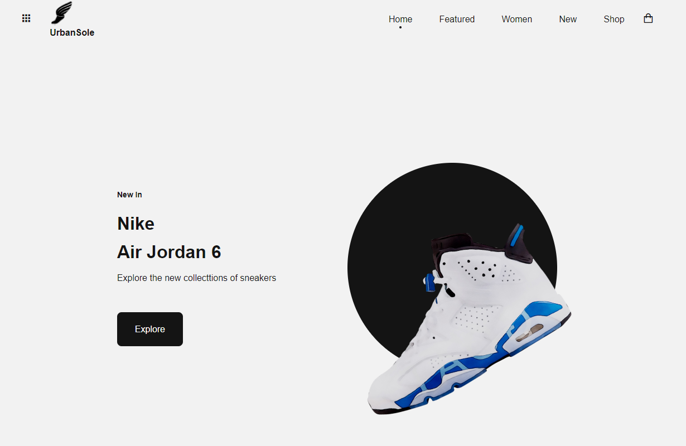

# Sneaker Website (Under Construction) A Sneak Peek 👟

**Please note that our website is a work in progress**, and while not all features may be available just yet, we're thrilled to offer you a glimpse of what's to come.

## Project Overview
Welcome to the Sneaker Website project, a work in progress! This project aims to create a dynamic and visually appealing sneaker website using HTML, CSS, and JavaScript. The website is designed to showcase a collection of sneakers and provide an immersive user experience.

**Note**: This website is currently under construction, and not all features may be available. It's a work in progress, and we appreciate your patience.

## Features
- `index.html`: The landing page introducing the website.
- `shop.html`: A page where users can explore and shop for sneakers.
- `script.js`: JavaScript file for implementing website functionality.
- `style.css`: Cascading Style Sheets for styling the website's appearance.

## How to Explore
1. Clone the repository to your local machine.
2. Open `index.html` in your web browser to view the landing page.
3. Navigate to `shop.html` to explore the available sneaker options.
4. Check out the JavaScript code in `script.js` to see the website's functionality.
5. Feel free to explore and customize the project as needed.

## Author
- [Ritik Nipane](https://github.com/RitzyKingS) - [GitHub Profile](https://github.com/RitzyKingS)

## License
This project is licensed under the [MIT License](LICENSE.md).

---

*Thank you for your interest in the Sneaker Website project. Please check back for updates as we continue to develop and improve this exciting project.*